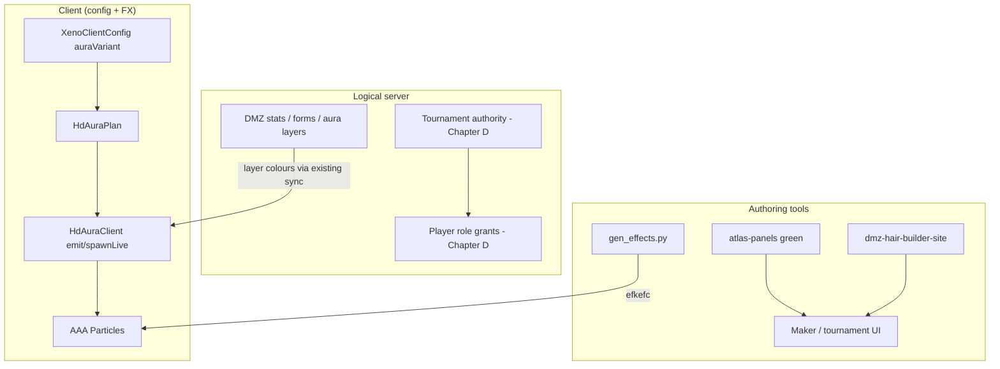
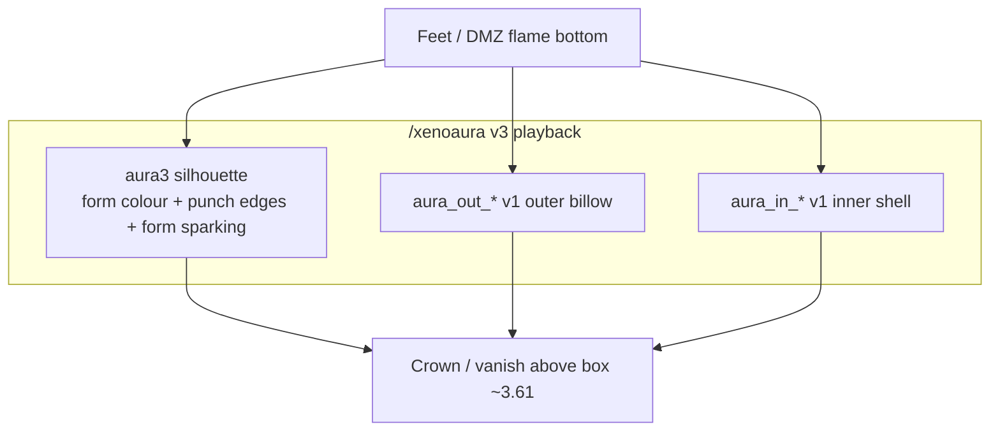
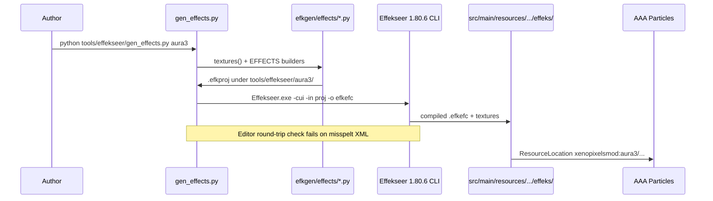
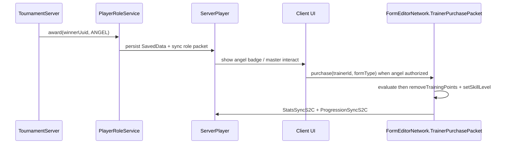
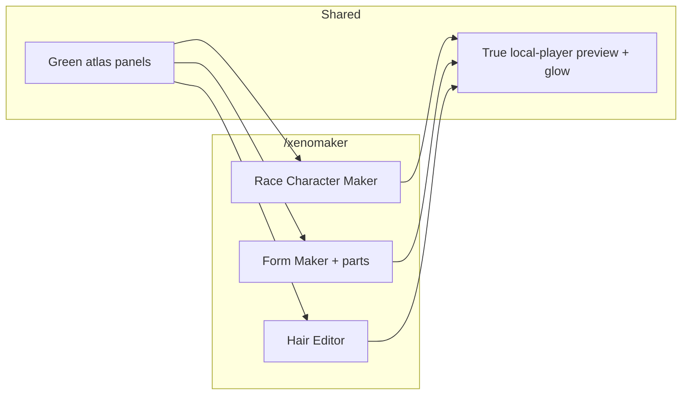

# Mega Design: HD Aura v3 + Tournament/Roles + Race/Hair Makers

| Field | Value |
| --- | --- |
| **Author** | XenoPixels design (draft) |
| **Date** | 2026-10-03 |
| **Status** | Draft (revision 4 — OQ1 default aura v1 confirmed 2026-10-03) |
| **Repo** | `C:\XenoPixelsNetwork_qwen` — NeoForge-only `xenopixelsmod` |
| **Target** | Minecraft 1.21.1 / NeoForge 21.1.248 / DragonMineZ 2.1.3 |
| **HEAD context** | `53a025e` (dirty tree; do not propose `git add -A`) |
| **Structure** | Chapters A–D + Shared Contracts + Key Decisions + PR Plan |

---

## Overview

This document unifies four related workstreams that share art pipelines, client/server authority boundaries, and evidence rules:

- **Chapter A** finishes the Jiren full-power **HD aura v3** look already partially shipped in code and generated assets.
- **Chapter B** makes **god-form aura identity** readable per form (SSB, Rose, UI, Ikari, …) on the existing nearest-colour palette without inventing new DragonMineZ form APIs. Client Phase 1 is brightness/stack presentation only; edge/thunder motifs are generation-time.
- **Chapter C** hardens the **Effekseer FX studio pipeline** that produces the ~1080 aura `.efkefc` files and related punch/sparking assets.
- **Chapter D** scopes the owner-picked **todolist slice**: angel/player roles from tournament awards, a 24/7 Budokai Tenkaichi-style bracket (~12 players), and green-atlas race/hair makers with live visualizers. **§D.0 is owner-confirmed 2026-10-03** (KD14); D1/D2/D5 are unblocked from D0 waits (evidence gates such as D2a auto-KO and D5 unlock appendix remain).

**Proposed solution:** stage **A → C tooling → B (split client vs generator) → D**, reusing green atlas tooling (`tools/atlas-panels/`), the external hair lab (`tools/dmz-hair-builder-site/`), and the form-editor network pattern (`FormEditorNetwork`), while keeping tournament/combat authority on the logical server and aura variant on client config.

---

## Background & Motivation

### Current aura state (verified in repo source)

HD aura planning and playback already exist:

| Piece | Path |
| --- | --- |
| Layer / FP / variant plan | `src/main/java/net/bullettrain/xenopixelsmod/fx/aura/HdAuraPlan.java` |
| Nearest palette + brightness suffixes | `src/main/java/net/bullettrain/xenopixelsmod/fx/aura/AuraPalette.java` |
| Emit / live scale / FP reposition | `src/main/java/net/bullettrain/xenopixelsmod/client/aura/HdAuraClient.java` |
| Client commands | `src/main/java/net/bullettrain/xenopixelsmod/client/command/XenoAuraCommands.java` |
| Ki Actions cycle | `src/main/java/net/bullettrain/xenopixelsmod/client/aura/AuraVariantNode.java` |
| v3 generator | `tools/effekseer/efkgen/effects/aura3.py` (+ `aura.py`, `aura2.py`) |
| Build entry | `tools/effekseer/gen_effects.py` |
| Shipped effects | `src/main/resources/assets/xenopixelsmod/effeks/{aura,aura2,aura3}/` |

**v3 layer recipe (code + generator, 2026-10-03):**

1. Silhouette: `aura3/aura3_<hex>[_nz][_bNN]` — spiked form-colour body (v2-style box).
2. Punch/ki-blast edges: ToonHit Glow `IMPACT_HOT → IMPACT_COOL` = RGB `(255,92,32) → (255,64,16)`, rising feet → crown → vanish (Jiren).
3. Form-coloured sparking: thunders / crackle / tongues / embers follow form colour (`aura3.py` `sparking(c)` — no fixed BT3 cyan).
4. Full v1 underlay: `aura/aura_out_*` + `aura/aura_in_*` with **v1** shape/drop (`HdAuraPlan.shape(false)`, `drop(false)`), not the silhouette box.

**First person (code + unit test; not verified in a running game):**

- `HdAuraPlan.cameraSpaceInFirstPerson()` → `true`
- Eye offset `{0, -0.6, -0.7}` (DMZ `AuraRenderer.executeAuraShaderDraw` pose)
- Scale factor `0.45`
- `spawnLive` repositions each frame from the main camera (`HdAuraClient.spawnLive`)

**God-form colours (repo JSON):**

- `src/main/resources/data/xenopixelsmod/dmz/races/saiyan/forms/xenopixels_gods_forms.json`
  - SSB / SSB3: `auraColor` `#29B6F6`, `extraAuraColor` `#01579B` (was ice `#E1F5FE`)
  - Rose / Rose3: pink / deep magenta extras
  - UI Sign / UI: pale cyan/white extras (luma risk for stacking)
  - UE: purple
- Ikari stack form: `src/main/resources/data/xenopixelsmod/dmz/forms/xenopixels_ikari.json` — `auraColor` `#40FF00`
- `HdAuraPlan.tooPaleToStack` skips Rec.709 luma ≥ `0.82` so ice-white extras do not become a white wall under additive sprites

**Palette:** `effeks/aura/palette.txt` currently lists **90** hex colours. Aura sets bake **90 × 6 brightness × 2 (depth/_nz) = 1080** `.efkefc` per set. Repo count for `effeks/aura3/*.efkefc` = **1080** (verified 2026-10-03 via filesystem count).

**Client jar cited by owner:** SHA-256 `c2a59e6dddde10a1c637bdb6d0828b56c6ed0b5f4229cd9ad14e485cf3c990b1` (form-coloured bolts) — **NOT verified in a running game**.

### Pain points

1. **Evidence gates still open** for size/placement, inner flicker while moving, NPC appearance-Off HD aura, and Sparking high-speed lag — changelog and code claim fixes, but runtime claims need a fresh process + current log.
2. **`--missing` rebuild trap:** `gen_effects.py --missing` only builds absent files (any `FOLDER` set including `aura` / `aura2` / `aura3`); changed looks stay stale until a full set rebuild. CLI help text still says “shared sets (aura, aura2)” and should list `aura3` when C1 lands.
3. **God-form identity** is mostly colour + stack rules today; lick/thunder density are **baked into `.efkefc`**, so a client MotifTable cannot change them without regeneration.
4. **Chapter D systems do not exist** in `src/` as player tournament/angel roles. Existing “roles” are **XenoNpc** roles (`XenoNpcRole`). DMZ decompiled refs show tournament **armor/quests**, not a bracket engine. Hair has an external lab; race content is form-group install + `character.json` price patch — not a new-race registrar.

### Explicitly deferred (NOT this doc)

NPC fly F-emulation, quest reward toggles, color pickers as standalone NPC work, skills text scale, lines/recipes/global tab, wave anim, schema unlocks, 1-block attack radius, quest re-edit, scripting/MyNPCs rewrite, retaliate-on-quest. **Unified Maker Studio** (race / form / hair exact DMZ layouts, optional new race ids when evidence READY) is **in scope** for Chapter D as of owner r3 2026-10-03 (KD15 r3 / KD20) — see D.3.

---

## Goals & Non-Goals

### Goals

| ID | Goal |
| --- | --- |
| G-A1 | Document and stabilize the v3 Jiren layer stack; land evidence-gated follow-ups without inventing unproven fixes. |
| G-A2 | Keep FP overlay aligned with DMZ camera-space numbers already in `HdAuraPlan`. |
| G-B1 | Per-form readable identity on `AuraPalette` nearest match. **Phase 1:** client brightness / suffix / stack presentation. **Phase 2:** generation-time edge/thunder/IMPACT motif overrides in `aura3.py`. No new DMZ form fields unless owner later extends JSON with verified keys. |
| G-C1 | Make FX rebuild/preview/check workflow explicit; prevent `--missing` from shipping stale art; add `Aura3EffectsTest`. |
| G-D1 | Design angel player roles awarded by tournament + angels as masters for god roles (D0 confirmed; D5 still needs unlock evidence appendix). |
| G-D2 | Design 24/7 open Budokai bracket (~12 participants) with DMZ-like green atlases from tools (D0 confirmed; auto-KO still needs PR-D2a). |
| G-D3 | Design **Unified Maker Studio**: exact DMZ-layout Race Character Creator + Form Maker (parts sub) + advanced Hair Editor; green atlases; true local-player full-body preview; per-segment hair + glow; new race ids when registration evidence READY; hair apply gated. |

### Non-Goals

- New particle engine or replacing AAA Particles.
- Architectury / Fabric dual-loader paths.
- Inventing DragonMineZ / MyNPCs / XenoPixels APIs not present in source or the pinned jar.
- Expanding public API outside `net.bullettrain.xenopixelsmod.api/**` without an owner decision.
- Using main `ModNetwork` (protocol `"101"`) for addon-facing packets; tournament addons use `AddonNetwork` if exposed.
- Committing, tagging, pushing, or `git add -A` on the dirty tree.
- Treating auto-KO or angel unlock apply as done before their evidence appendices (D2a / D5).
- Client MotifTable changing baked lick/bolt spawn rates without regenerating effects.

---

## Proposed Design

### Shared contracts (all chapters)

1. **Evidence ladder:** repo source → tracked decompiled (`tools/generated/**`) → `javap` against exact jar → pinned docs. Runtime claims need a fresh process + current `run/logs/latest.log`.
2. **Public API:** only `net.bullettrain.xenopixelsmod.api/**`. Addon packets → `AddonNetwork`. DMZ patches additive-only.
3. **Authority:**
   - Aura **variant / style / size / brightness** = **client config** (`XenoClientConfig`, `/xenoaura`).
   - Tournament brackets, match results, role grants, race/hair persistence that affects other players = **logical server**.
4. **NeoForge-only** for this design.
5. Sprite scale: Effekseer sprite of scale `s` is **`s` across** (quad ±0.5), not `2s` (documented in `CHANGELOG.md` / `aura3.py`).



---

## Chapter A — Jiren full-power v3 look

### A.1 Layer stack (as shipped in code)



**Emit path** (`HdAuraClient.emit`, silhouette branch when `variant2() || variant3()`):

The empty-extras / real-extras split is a **deliberate second argument to `HdAuraPlan.plan`**, not a per-row property of each `Aura`. Verbatim call shapes:

```java
// Silhouette (v2 and v3): always plan with empty extras Set so extras are separate silhouettes
for (HdAuraPlan.Aura aura : HdAuraPlan.plan(plan, Set.of(), true)) {
    // spawn aura3/aura3_<hex>[_nz]  (or aura2/…) at silhouette shape/drop
}

// v3 only: full v1 underlay beside silhouette — uses real extras + auraLayers config
if (variant3()) {
    for (HdAuraPlan.Aura aura : HdAuraPlan.plan(plan, extras, XenoClientConfig.auraLayers)) {
        // spawn aura/aura_out_* and aura/aura_in_* at v1 shape/drop
    }
}
```

Do **not** “fix” this into branching on whether an individual aura’s extras are empty.

**Generator path** (`aura3.py`):

- Silhouette frames + `licks(...)` Edge/Foot/Rise/Crown in `IMPACT_HOT/COOL`
- `sparking(c)` form-coloured bolts/crackle/tongues/embers
- Does **not** bake v1 inner/outer into the `.efkefc` (game plays them beside)

### A.2 First-person overlay

Keep the current contract; do not reintroduce the old world-space 4.5-block billboard:

```java
// HdAuraPlan — already implemented
cameraSpaceInFirstPerson() == true
firstPersonEyeOffset() == {0f, -0.6f, -0.7f}
firstPersonScaleFactor() == 0.45f
```

`spawnLive` already branches when `target == view.player` and first person: sets world position from `firstPersonWorldPos(cam…)` and multiplies scale by `firstPersonScaleFactor()`.

**Unit coverage:** `HdAuraPlanTest.firstPersonUsesTheDmzCameraOverlay`. **Runtime: not verified.**

### A.3 Open follow-ups (evidence gates — do not invent fixes)

| Issue | What we know | Required evidence before “fixed” |
| --- | --- | --- |
| Size / placement | Authored to DMZ flame box; `/xenoaura box` wireframe exists | Fresh client log + owner screenshot with `/xenoaura both` + `box on` |
| Inner flicker while moving | Live stretch updates every frame; hitch resend at 250 ms | Reproduce with motion + form; capture fps/hitch logs (`/xenoaura debug on`) |
| NPC appearance-Off | `tickNpcs` uses `NpcAuraClient.hdLayers` when Full-appearance SEEN path misses | Confirm appearance-Off NPC with aura on in fresh session |
| Sparking high-speed lag | Sparking FX are separate slots; v3 also embeds form sparking in aura3 | Profile particle count / AAA emitters at Sparking + high speed; no speculative cull without numbers |

### A.4 Risk register (Chapter A)

| Risk | Severity | Mitigation |
| --- | --- | --- |
| Stale aura3 in jar after Python change | High | Full `gen_effects.py aura3` (no `--missing`); jar hash in handoff |
| Double-draw cost (v1+v3) | Medium | Keep `/xenoaura hd\|dmz\|both`; default variant stays **v1** (KD19); players opt into v3 |
| FP still fills view on some FOV | Medium | Evidence gate; tunables already centralized in `HdAuraPlan` |
| Claiming in-game verification from unit tests | High | Changelog already says “not yet seen”; keep that language |
| Mass `.efkefc` commit on dirty tree | High | Path-scoped staging plan (PR-A2); never `git add -A` |

---

## Chapter B — God-form aura identity

### B.1 Colour identity (verify, don’t invent)

Nearest-colour mapping is already the contract:

- Runtime colours from DMZ layers → `AuraPalette.rgb` → `AuraPalette.nearest` → baked `effeks` hex.
- Palette resource: `/assets/xenopixelsmod/effeks/aura/palette.txt` (90 entries as of 2026-10-03).
- Distance: redmean weighted RGB (`AuraPalette.distance`), matching the generator.

**Verified form samples:**

| Form | auraColor | extraAuraColor | Notes |
| --- | --- | --- | --- |
| SSB / SSB3 | `#29B6F6` | `#01579B` | Navy extra for stack; pale ice removed |
| SSBE | `#01579B` | `#81D4FA` | |
| SSRose / Rose3 | `#FF69B4` | `#C71585` | |
| UI Sign | `#B0BEC5` | `#FFFFFF` | White extra: `tooPaleToStack` |
| UI | `#E0F7FA` | `#FFFFFF` | Pale; stack skip likely |
| UE | `#7B1FA2` | `#E1BEE7` | |
| SSG | `#FF5252` | `#FFCDD2` | |
| Ikari | `#40FF00` | `#FFFFFF` | Separate group `xenopixels_ikari`; Ikari is **not** the god-form stack |

`IkariStackRules` already refuses stacking Ikari onto god forms (tests present). Keep that.

### B.2 Motif rules without new DMZ form APIs

**Constraint (KD5 / KD13):** Edge weight (lick spawn rate / alpha), thunder density (`FormBolts` every-N), and Rose “magenta-biased mix into IMPACT” are authored in `aura3.py` (`licks(...)`, `sparking(c)`) and compiled into `.efkefc`. `HdAuraClient` only picks effect **names** and scales **brightness** (`auraBrightness`, `auraInnerBrightness`, `AuraPalette.brightnessSuffix`). A client MotifTable **cannot** change edge/thunder density without a regenerated set (or many named variants).

#### Keying scheme (chosen)

```text
MotifKey = raceId + "/" + formGroup + "/" + formName
  e.g. "saiyan/xenopixels_gods_forms/ssb"
Fallback: formGroup + "/" + formName, then palette hex only
```

Resolve key from the same DMZ stats accessors `HdAuraClient` already uses for layers (`DmzAccess.stats` → active form / stack form). Do **not** add undocumented JSON keys to DMZ form files in this design.

#### Phase 1 — client presentation only (PR-B1)

| Knob | Where applied | Not allowed in Phase 1 |
| --- | --- | --- |
| Inner brightness multiplier | `HdAuraClient.emit` when spawning `aura_in_*` (multiply into `XenoClientConfig.auraInnerBrightness * aura.alpha()`) | Changing lick emitters |
| Overall brightness bias | Optional bias before `AuraPalette.brightnessSuffix` / `AuraPalette.visible` | Renaming effect paths mid-flight |
| Stack / pale presentation | Already via `HdAuraPlan.plan` + `tooPaleToStack` — Motif may only document expected stack behaviour per form, not reimplement | Inventing new layer APIs |

File: `src/main/java/net/bullettrain/xenopixelsmod/fx/aura/AuraMotifTable.java` (client-safe constants + lookup). Optional JSON under `assets/xenopixelsmod/aura/motifs.json` loaded once — still presentation multipliers only.

**Call sites:** only `HdAuraClient.emit` (v1 underlay brightness) and optionally `tickRims` shine path. Silhouette spawn path does not gain Phase-1 density knobs.

#### Phase 2 — generation-time Motif overrides (PR-B3, after A2/C2)

Python table (e.g. `tools/effekseer/efkgen/effects/aura_motifs.py`) consumed by `aura3.py`:

| Motif | Generator effect |
| --- | --- |
| Edge weight | Scale `licks(...)` `every` / alpha |
| Thunder density | Scale `bolts(...)` / `sparking` intervals |
| IMPACT mix | Optional form-tint of `IMPACT_HOT/COOL` (Rose magenta bias) |

Requires full `gen_effects.py aura3` rebuild. Do not ship PR-B1 as “god-form identity complete” for edge/thunder.

### B.3 Stack / pale rules (keep)

```text
tooPaleToStack(rgb) when Rec.709 luma >= 0.82
v2/v3 silhouette plan uses empty extras Set → extras are separate silhouettes
pale extras must not spawn as additive white walls
SSB extra #01579B stacks at ~1.15× (covered by HdAuraPlanTest)
```

---

## Chapter C — Effekseer FX studio pipeline

### C.1 Pipeline (as implemented)



| Item | Location |
| --- | --- |
| Entry | `tools/effekseer/gen_effects.py` |
| README | `tools/effekseer/README.md` |
| Editor | `tools/new_particles/Effekseer1.80.6Win` (`Tool/Effekseer.exe`) |
| Docs | `docs/effekseer-fx.md`, `docs/superpowers/specs/2026-09-28-effekseer-fx-design.md` |
| Playback | AAA Particles 2.3.1 (`aaa_particles`) |

### C.2 Rebuild policy (mandatory)

| Command | When to use |
| --- | --- |
| `python tools/effekseer/gen_effects.py aura3` | **Any** look change (colours, licks, bolts, blend) |
| `… aura3 --missing` | **Only** filling absent hex/brightness files; **does not** rebuild changed definitions |
| Full aura2 after silhouette/edge change | Same rule — CHANGELOG already warns |

Expect sequential editor compile ~1.75 s/effect → ~30+ minutes for 1080 files. Record wall time and output hash in handoff.

**Tooling note (PR-C1):** update `gen_effects.py` argparse `--missing` help from “shared sets (aura, aura2)” to include **aura3** (and any `FOLDER` set). Behaviour already routes all `FOLDER` sets through `build_missing`.

### C.3 Studio ergonomics (design additions)

1. **Manifest stamp:** after each set build, write `tools/effekseer/<set>/BUILD_STAMP.json` with git commit, palette hash, generator module mtime, effect count (tooling only; optional resource copy).
2. **Presence tests:** add **`Aura3EffectsTest`** mirroring `Aura2EffectsTest` (assert 90×6×2 names under `effeks/aura3`). `EffectAssetsTest` already walks lowercase paths for all effeks but does **not** assert the aura3 matrix — do not treat it as sufficient for count/hex coverage.
3. **Preview:** `gen_effects.py --preview` and `tools/effekseer/preview.ps1` remain Windows mouse-driven; do not claim headless golden frames without implementing them.
4. **No second engine:** all new aura looks stay Effekseer → AAA.

### C.4 Punch / edge colour reuse

Punch slots `punch_impact` / `punch_heavy` ToonHit Glow already use IMPACT_HOT/COOL. v3 intentionally reuses that RGB for aura edges and rising tongues. Keep a single constant source in Python (`aura2.IMPACT_HOT/COOL` imported by `aura3`) so punch and aura cannot drift.

---

## Chapter D — Todolist slice (tournament / roles / makers)

Source: `todolist.md` lines 16–21 (owner pick). **None of these are implemented as player systems in `src/` today.** Reuse adjacent systems below.

### D.0 Owner-confirmed decisions (2026-10-03)

**Status: FINAL** — owner accepted all provisional defaults below on 2026-10-03. These are Key Decisions (KD14), not open product questions. PR-D1 / PR-D2 / PR-D5 are **unblocked from waiting on D0**. Remaining gates: PR-D2a before automatic KO; D5 unlock evidence appendix before inventing apply paths.

| ID | Decision (final) | Notes |
| --- | --- | --- |
| D0-a | **Primary:** 24/7 challenger queue + king-of-hill (max 12 queued). **Secondary:** single-elim event (manual open). Ship queue first. | Closes former OQ2 |
| D0-b | Angel powers = **cosmetic + trainer/master only** — no combat stat modifiers in v1 | Closes former OQ3 |
| D0-c | Angels may offer **`xenopixels_gods_forms` only** | Closes former OQ4 |
| D0-d | Overworld `SavedData` patterned on `FleetChannelSavedData` (`FILE_NAME`, `computeIfAbsent` on overworld storage) — e.g. `xenopixels_tournament` / `xenopixels_player_roles` | Closes former OQ8 |
| D0-e | Dedicated channel `ResourceLocation(MOD_ID, "tournament")` protocol `"1"`. Roles may share that channel or `player_roles` `"1"`. Never overload `ModNetwork` `"101"` without bump plan. | |
| D0-f | **v1 = static configured arena positions** (dimension + BlockPos list in server config). No instanced dimensions until a later design cites an in-repo instance system. | |
| D0-g | **v1 = admin/report-only match results** (`/xenotourney result …`). Automatic KO only after spike PR-D2a lists verified death/damage events. | D2 ships admin results; auto-KO gated on D2a |

### D.1 Angels / roles

**Owner intent:** tournament awards → angel **player** roles; angels act as masters for gods roles.

**Existing adjacent systems (do not confuse):**

| System | What it is | Reuse? |
| --- | --- | --- |
| `XenoNpcRole` | NPC entity roles (trader/quest/…) | Pattern for bounded ids — **not** player angels |
| `CombatSkills.grant` / `/xenoskill grant` | Exclusive skill grants | Admin-style grants only; not the form TP path |
| `DmzFormTrainerScreen` / masters | Form trainers / skill masters | UI pattern for “angel as master for gods” |
| `XenoPermissions` | Permission nodes | Gate admin grant / tournament admin |
| `FleetChannelSavedData` | Overworld SavedData precedent | Persistence pattern for roles |

**Proposed player role model:**

```text
PlayerRoleId = enum or string registry: none | angel | (future…)
Storage: SavedData (D0-d) UUID → role, synced to client for UI only
Grant sources: tournament award pipeline (D.2), admin `/xenorole`
Angel powers v1 (D0-b): cosmetic badge + constrained gods trainer — no combat mods
```

#### Angel → gods unlock — verified apply path (not evaluate-only)

`DmzTrainerPurchase.evaluate(...)` returns **only** `allowed/cost/nextLevel/message`. It does **not** debit TP or write skill levels.

The **apply** path already used by trainers is `FormEditorNetwork.TrainerPurchasePacket.purchase` (PLAY_TO_SERVER id 4):

1. Validate trainer entity / distance / offerings (`DmzFormMetadataRegistry.trainerOfferings`).
2. `decision = DmzTrainerPurchase.evaluate(...)`.
3. If allowed: `data.getResources().removeTrainingPoints(decision.cost())`, `data.getSkills().setSkillLevel(metadata.formType, decision.nextLevel())`, `data.updateTransformationSkillLimits(race)`.
4. Sync: `NetworkHandler.sendToTrackingEntityAndSelf(new StatsSyncS2C(player), player)` and `ProgressionSyncS2C`.

Client entry: `FormEditorNetwork.purchase(trainerEntityId, formType)` from `DmzFormTrainerScreen`.

**PR-D5** is evidence/spike first: confirm angel players can be registered as trainers / offerings source without inventing new DMZ unlock APIs; then reuse this apply path. Until that appendix exists, D5 must not invent alternate grant calls. `CombatSkills.grant` remains admin-only for exclusive skills — not a substitute for form TP purchases unless owner chooses that product path.



### D.2 Tournament Budokai Tenkaichi

**Owner intent:** advanced 24/7 open bracket, ~12 participants, DMZ-like atlases from tools.

**DMZ evidence:** decompiled content has `a18_tournament` armor and quest ids (`04_enter_the_world_tournament`, etc.) — **no** reusable bracket/matchmaking engine found under `tools/generated/dmz_decompiled_full`. Design a **Xeno-owned** tournament service.

**Proposed domain model (D0 owner-confirmed):**

| Entity | Fields |
| --- | --- |
| `TournamentSeason` | id, mode (`queue` \| `event_elim`), maxEntrants=12, arenaPos list, state |
| `Entrant` | player UUID, seed, status (queued/active/eliminated) |
| `Match` | id, entrantA/B, bestOf, arenaIndex (into static list), result, reportedBy (admin/system) |
| `Bracket` / `Queue` | per D0-a |

**Authority / anti-cheat:**

- Match start/end and winner = server only.
- Client may show bracket UI; never trust client-reported KO for awards.
- **v1 results:** admin/report-only (`D0-g`). Do **not** imply automatic awards in D3 until spike PR-D2a lands with verified death/damage event list.

**UI atlases:** generate green DMZ-alike panels via `tools/atlas-panels/dmz_atlas_generator.py` (`palette="green"`) and existing `XenoAtlasSprites` / `Atlas*` widgets (`docs/atlas-ui-doco.md`). Add PanelSpecs for bracket rows if sizes missing — **never stretch** baked borders.

### D.3 Unified Maker Studio (KD15 r3 / KD20 — owner 2026-10-03)

**Owner intent (screenshots + chat):** one highly advanced in-game maker resembling DMZ Character Creator / Form Maker / Hair Editor photos; green atlases from `tools/atlas-panels/`; **new race ids**; in-game parts; **full-body visualizer that updates on every change**; per-segment hair edit; **selected part highlighted with green glow**; Form Maker includes a parts sub-screen.

**Navigation (owner):** exact DMZ layout clone **per photo**, wired under one `/xenomaker` command (hub → Race / Forms / Hair screens).

**Preview (owner):** must be the **true local-player DMZ model** (first-person-ready player stack). Text-summary or disposable dummy is **not** acceptance. If no verified player-model draw path exists, evidence appendix = BLOCKED and implementation stops for owner decision.

**New race ids (owner):** full registration **if evidence READY**. Evidence must inventory DMZ race discovery (`RaceCharacterConfig`, config scan, bootstrap). If BLOCKED, Create Race stays disabled with cited blocker; editing known races + forms + hair still ships.

**Verified bootstrap (do not over-read until Task 7 appendix):**

- `DmzContentBootstrap` installs form JSON under races and patches `character.json` prices — it does not by itself prove a public “register race” API.
- Decompiled `RaceCharacterConfig` has many fields; discovery/registration must be cited before create ships.
- Appearance part counts: `NpcAppearanceParts` / `TextureCounter` — cite before wiring Body/Eyes/Mouth/Hair/Aura/Clothes/Extra grids.

**Screens:**

1. **Race Character Maker** — race cards, Male/Female, category column, part grid, right full-body preview + glow on selected part.
2. **Form Maker** — form list, form settings (verified document fields only), dual preview, **parts sub-screen**.
3. **Hair Editor** — style list, large preview with green glow on selected style/strand, per-segment transforms, colors, Export + gated Apply.

**Atlases:** `tools/atlas-panels/dmz_atlas_generator.py` `palette="green"`; never stretch baked borders.

### D.4 Hair maker (inside Unified Maker)

**Owner intent:** per-segment connected/movable parts; green atlases; visualizer on every change; glow on selection (screenshots 5–6).

**Existing asset:** `tools/dmz-hair-builder-site/` — `HairStrand` has length/curve/scale/rotation — **no** `connected` or `movable` boolean. Parenting exists as geometry in `createStrandGroup` (`hair-geometry.ts`).

**v1 interpretation (KD16):**

- **Connected** = always-parented cubes within a strand (lab today). **No new schema flag** in v1.
- **Movable** = editing strand/cube transforms already in `HairStrand`.
- Cross-strand constraints or a new `connected` boolean = **schema vNext** only after owner reopens OQ6.

**Write-back (critical):**

- `CustomizationManager` HAIR entries are cosmetic `hair_style_*` slots — **not** the DMZ hair codec.
- Codec/export golden vectors; Apply via cited path (e.g. `UpdateCustomHairC2S`) or stays disabled.
- Preview must use `MakerPreviewController` (true player), not text lines.



### D.5 Chapter D risks

| Risk | Severity | Mitigation |
| --- | --- | --- |
| Confusing NPC roles with player angels | High | Separate package `…features.tournament` / `…features.playerrole`; never overload `XenoNpcRole` |
| Inventing DMZ tournament APIs | High | Xeno-owned bracket; cite only verified armor/quest strings as flavour |
| Inventing new-race registration | High | Evidence appendix before Create Race; UI disable if BLOCKED (KD15 r3) |
| Fake “full body” preview (text/dummy) | High | KD20: true local-player path or STOP |
| Hair codec / CustomizationManager mismatch | High | Split export vs apply; evidence gate on apply |
| Pointing at evaluate-only purchase API | High | Reuse `TrainerPurchasePacket.purchase` apply steps |
| 12-player 24/7 empty bracket UX | Medium | Queue + KotH (D0-a, owner-confirmed) |
| Inventing auto-KO without D2a | High | Admin/report v1 until PR-D2a evidence |

---

## API / Interface Changes

### Chapter A–C (mostly internal)

No new public API required. Client commands already:

```text
/xenoaura v1|v2|v3|dmz|hd|both|size|brightness|layers|follow|live|maxheight|box|overlay|firstperson|debug|inner
```

Ki Actions: `AuraVariantNode` cycles v1→v2→v3→v1. Server aura on/off remains separate (`SecondAura*` / DMZ).

### Chapter D (proposed; not implemented)

| Surface | Visibility | Notes |
| --- | --- | --- |
| `PlayerRoleService` + `/xenorole` | Internal + op | SavedData D0-d; not under `api/**` until promoted |
| Tournament channel `tournament` protocol `"1"` | Internal | Dedicated SimpleChannel; CHANGELOG on bump |
| Optional `api` read-only queries later | Public | Only if addons need bracket display |

**Before/after for aura identity:**

```text
Before: form colour → nearest(palette) → effect name
After Phase 1: form colour → nearest(palette) → effect name
               + AuraMotifTable.get(race/group/form).innerBrightnessMul
After Phase 2: generator aura_motifs.py adjusts licks/bolts/IMPACT → rebuild aura3
```

---

## Data Model Changes

| Area | Change | Migration |
| --- | --- | --- |
| Aura assets | Regenerated `.efkefc` when Python changes | Full set rebuild; jar includes resources; path-scoped git add |
| `palette.txt` | Only when new form colours miss nearest badly | Rebuild all aura sets sharing palette |
| Player roles | `SavedData` file e.g. `xenopixels_player_roles` (FleetChannel pattern) | Default `none`; additive |
| Tournament | `SavedData` file e.g. `xenopixels_tournament` | Config flag default off |
| Race maker v1 | Form-group JSON under existing `data/xenopixelsmod/dmz/races/<race>/forms/` | `DmzContentBootstrap` install + backup; price patch only via existing character.json merge |
| Hair maker | Project JSON export; apply TBD | Codec fixtures first; no CustomizationManager false path |

---

## Alternatives Considered

### Alternative 1 — Bake v1 inner/outer into aura3 `.efkefc`

- **Pros:** One emitter; possibly less spawn churn.
- **Cons:** Breaks `/xenoaura inner` dimming; mixes v1 and silhouette boxes; larger rebuilds; fights current `playsV1Outer/Inner` design.
- **Decision:** Reject. Keep game-side full v1 underlay (already shipped).

### Alternative 2 — Server-forced aura variant

- **Pros:** Uniform look in tournaments.
- **Cons:** Violates current client-config contract; needs protocol + sync; fights `/xenoaura` and Ki Actions.
- **Decision:** Reject for global force. Optional **tournament client rule** packet later (Open Question) without changing default SP/MP freedom.

### Alternative 3 — Reuse `XenoNpcRole` for angels

- **Pros:** Existing role JSON/behaviour framework.
- **Cons:** NPC entity-type coupling; editor validation; wrong abstraction for players.
- **Decision:** Reject. New player-role registry.

### Alternative 4 — Depend on DMZ minigame/tournament code

- **Pros:** Flavour alignment.
- **Cons:** No bracket engine found in decompiled tree; armor/quests only.
- **Decision:** Reject as foundation. Xeno-owned tournament service; DMZ art/quests optional flavour only.

### Alternative 5 — Ship race/hair makers before aura polish

- **Pros:** Todolist visibility.
- **Cons:** Aura jars/pipeline unfinished evidence; makers need green atlas discipline; higher merge conflict risk.
- **Decision:** Reject staging order. **A→C→B→D** unless owner overrides.

### Alternative 6 — Motif as generator-only named overrides / aura4 (no client table)

- **Pros:** Honest about baked parameters; one place for edge/thunder; no false Phase-1 promises.
- **Cons:** Slow iteration (30+ min rebuilds); no cheap inner-brightness per-form tweak without assets.
- **Decision:** **Reject as sole approach.** Accept **hybrid (KD13):** Phase 1 client presentation multipliers + Phase 2 generator motif table. Reject “client table alone changes density.”

### Alternative 7 — Owner-extended DMZ form JSON motif keys after verified schema

- **Pros:** Data-driven per form in the same files authors already edit.
- **Cons:** Requires verified DMZ schema tolerance for unknown keys or a confirmed extension point; risks DMZ load failures if inventing keys.
- **Decision:** **Defer.** Out of scope until owner commissions a schema-evidence spike. Motif stays in Xeno client table + Python generator files.

### Alternative 8 — Keep hair maker external-only with export download

- **Pros:** Lab already has live visualizer; avoids unverified in-game apply; smaller PR risk.
- **Cons:** Todolist asks for green-atlas in-game maker; workflow split between browser and game.
- **Decision:** **Accept as v1 fallback / D7a–b path.** In-game green UI may export only until D7c evidence; do not block all hair work on apply.

---

## Security & Privacy Considerations

| Threat | Mitigation |
| --- | --- |
| Client spoofs tournament win | Server-only result commit; v1 admin/report; ignore client KO for awards |
| Client spoofs angel role | Role grants only from server award/admin paths; client display is cosmetic |
| Race/hair JSON path traversal | Validate ids `[a-z0-9_]`; write only under xenopixels data dirs; size caps like `FormEditorNetwork.MAX_JSON` |
| Op-only generators accidentally exposed | Keep Effekseer tooling offline; no runtime shell-out to Effekseer.exe |
| Permission escalation via master menu | Angel master flows require role **and** reuse `TrainerPurchasePacket` distance/offering checks |

Privacy: tournament brackets show player names already public in MP; no extra PII store beyond UUID + name.

---

## Observability

| Signal | Mechanism |
| --- | --- |
| Aura pulse / hitch | `/xenoaura debug on` → `XenoPixelsMod.LOGGER` lines in `HdAuraClient.play` |
| Live scale failure | `liveFailed` warn once per session |
| FX build | Generator stdout + round-trip failures; BUILD_STAMP |
| Tournament | Server log match start/end/award; optional metrics counters |
| Role grant | Log grant source (tournament id / admin / command) |

Alerting: none automated in-mod; handoff requires paste of fresh `latest.log` excerpts for runtime claims.

---

## Rollout Plan

1. **Feature flags / config**
   - Aura: already client (`auraVariant` default `v1`).
   - Tournament: `XenoServerConfig` master switch default **off**.
   - Player roles: default none; awards no-op if tournament flag off.
   - Makers: op/permission gated screens.
2. **Staged rollout:** merge PRs per plan below; D0 is confirmed so D1/D2 may proceed (admin results only until D2a). Ship aura asset jars before enabling tournament cosmetics that assume v3.
3. **Rollback:** revert PR; for assets, restore previous `effeks/aura3` from git; tournament flag off leaves no bracket state required.
4. **Dirty tree rule:** stage reviewed paths only; never `git add -A`. For PR-A2, require prior `git status --short`, an explicit path list (e.g. `effeks/aura3/**`, generator sources, `Aura3EffectsTest`), and handoff jar SHA.

---

## Key Decisions

| # | Decision | Rationale |
| --- | --- | --- |
| KD1 | Keep v3 = silhouette aura3 + full v1 underlay | Already implemented; preserves inner brightness control and box separation |
| KD2 | FP = DMZ camera overlay numbers in `HdAuraPlan` | Owner 2026-10-03; unit-tested; old world billboard removed |
| KD3 | Aura variant remains client config | Existing `/xenoaura` + Ki Actions; server authority reserved for combat/tournament |
| KD4 | Full aura set rebuild required for look changes; `--missing` is not enough | Generator flag semantics verified in `gen_effects.py` |
| KD5 | Motif hybrid: Phase 1 client brightness/stack only; Phase 2 generator edge/thunder/IMPACT; no invented DMZ form fields | Baked `.efkefc` cannot change density at runtime |
| KD6 | Pale extras skipped via `tooPaleToStack`; SSB extra `#01579B` | Fixes white-wall; tests in `HdAuraPlanTest` |
| KD7 | Tournament is Xeno-owned; do not claim DMZ bracket APIs | Decompiled tree lacks engine |
| KD8 | Player angel roles ≠ `XenoNpcRole` | Different authority and lifecycle |
| KD9 | Makers use green `atlas-panels` + live preview; hair ports lab model; export-first until apply verified | Reuses proven generators; avoids false CustomizationManager path |
| KD10 | PR staging A→C tooling→A2→B1→…→D; D0 closed 2026-10-03 | Aura/pipeline before large server+UI; D1/D2/D5 unblocked from D0 (evidence gates remain) |
| KD11 | Runtime verification language stays “not verified” until fresh process proof | Agents.md / repo contract |
| KD12 | NeoForge-only; AAA Particles only | Explicit non-goals |
| KD13 | MotifKey = `raceId/formGroup/formName`; Phase 1 call sites = `HdAuraClient.emit` (inner) ± rims | Single keying scheme; no density knobs in Phase 1 |
| KD14 | Tournament/roles v1 per owner-confirmed D0 (2026-10-03): queue+KotH first; angels cosmetic+trainer; gods_forms only; FleetChannel SavedData; channel `tournament` `"1"`; static arenas; admin/report results | Owner final; not provisional |
| KD15 | **r3 2026-10-03:** Unified Maker Studio; new race ids allowed when registration evidence READY; Create Race disabled if BLOCKED | Owner overturn of form-groups-only |
| KD16 | Hair “connected” = lab strand parenting; no new boolean in v1 | Matches `hair-model.ts` / `hair-geometry.ts` |
| KD17 | Angel unlock reuses `FormEditorNetwork.TrainerPurchasePacket` apply path; D5 starts as evidence spike | `evaluate` is decision-only |
| KD18 | Add `Aura3EffectsTest` (mirror `Aura2EffectsTest`); EffectAssetsTest ≠ matrix coverage | Review evidence |
| KD19 | Default `auraVariant` remains **`v1`**. Players opt into v3 via `/xenoaura v3` or Ki Actions (`AuraVariantNode`) until a later explicit owner change | Owner final 2026-10-03 (closes OQ1) |
| KD20 | Unified Maker: exact DMZ-layout Race / Form / Hair under `/xenomaker`; **gold banner chrome + green inners**; true local-player full-body preview on every change (≤50 ms); green glow on selected part/segment; Form Maker parts sub-screen; per-segment hair; **AtlasCycle + InlineColorPicker**; DMZ creation presets live+fallback | Owner screenshots + decisions 2026-10-03 (incl. gold/modern/presets follow-on) |

---

## Open Questions

| # | Question | Blocks | Notes |
| --- | --- | --- | --- |
| 1 | ~~Default aura variant~~ | — | **Decided 2026-10-03 (KD19):** keep default **`v1`**; opt-in to v3 via `/xenoaura v3` or Ki Actions |
| 2 | ~~Tournament structure~~ | — | **Decided 2026-10-03 (D0-a / KD14):** queue+KotH primary; single-elim secondary; ship queue first |
| 3 | ~~Angel powers~~ | — | **Decided 2026-10-03 (D0-b / KD14):** cosmetic + trainer/master only; no combat mods in v1 |
| 4 | ~~Gods master list~~ | — | **Decided 2026-10-03 (D0-c / KD14):** `xenopixels_gods_forms` only |
| 5 | ~~New DMZ races later?~~ | — | **Reopened 2026-10-03 (KD15 r3):** ship when registration evidence READY; else Create Race disabled |
| 6 | Cross-strand connected/movable schema? | D7 schema vNext | **v1 closed:** lab parenting (KD16) |
| 7 | Tournament client aura rule: force `v3`? | Optional later | Non-blocking |
| 8 | ~~Tournament/role persistence store~~ | — | **Decided 2026-10-03 (D0-d / KD14):** overworld SavedData, FleetChannel pattern |
| 9 | Jar SHA `c2a59e6d…` artifact path + in-game verification session? | Runtime claims | Evidence |
| 10 | NPC appearance-Off: is `tickNpcs` enough? | PR-A3 | Evidence |

---

## PR Plan

Ordered to match the dependency sketch. **“Independently mergeable” means each PR can land alone once its Blocked-on column is clear.** D0 is owner-confirmed (2026-10-03); D1/D2/D5 no longer wait on product decisions—only on remaining evidence gates noted below.

| PR | Title | Scope | Blocked on | Merge gate |
| --- | --- | --- | --- | --- |
| **PR-A1** | Aura v3 docs/tests only | Document emit `plan(...)` shapes; extend `HdAuraPlanTest` / comments; **no behaviour change** unless a test proves a bug | — | Focused tests; no mass assets |
| **PR-C1** | FX pipeline stamps + docs + `--missing` help | BUILD_STAMP; README/`docs/effekseer-fx.md`; argparse help lists aura3; **add `Aura3EffectsTest`** | — | `Aura3EffectsTest` green; tooling only |
| **PR-A2** | Aura3 asset refresh | Full `gen_effects.py aura3` (no `--missing`); resource commit | C1 recommended first | Explicit path list + prior `git status --short`; 1080 files; handoff jar SHA; never `git add -A` |
| **PR-A3** | Evidence pass follow-ups | Fixes only with fresh logs/screenshots (size, flicker, NPC appearance-Off, Sparking lag) | Runtime evidence | Skip if no evidence |
| **PR-C2** | IMPACT single-source + punch parity | Python constant assert; optional punch RGB vs aura3 edges | — | Generator unit/assert |
| **PR-B1** | Client AuraMotifTable Phase 1 | Brightness/inner multipliers + keying; **not** edge/thunder | A1 | Unit tests; SSB/Rose/UI/Ikari fixtures; docs state Phase-1 limits |
| **PR-B2** | Form colour audit | Palette coverage; add hex only if nearest distance exceeds owner threshold | — | Rebuild aura sets if palette changes (A2 pattern) |
| **PR-B3** | Generator motif overrides Phase 2 | `aura_motifs.py` → aura3 licks/bolts/IMPACT; full rebuild | A2, C2 | Full aura3 rebuild; Aura3EffectsTest |
| **PR-D1** | PlayerRole foundation | SavedData + sync + `/xenorole`; cosmetic role only (D0-b) | — (D0 confirmed) | Persistence tests; FleetChannel SavedData pattern |
| **PR-D2a** | Tournament KO spike (evidence) | List verified death/damage events **or** keep admin-only | — | Written evidence appendix; no invented hooks; **required before auto-KO** |
| **PR-D2** | Tournament core | Queue+KotH lifecycle, static arenas, config flag off, **admin/report results** (D0-a/f/g) | — (D0 confirmed); auto-KO needs D2a | Server tests; admin results only unless D2a enables auto |
| **PR-D3** | Tournament → Angel awards | Wire **server-committed** results → `PlayerRoleService` | D1, D2; auto-KO awards only if D2a done | Integration tests |
| **PR-D4** | Tournament green atlas UI | PanelSpecs + bracket screen | D2 domain stable enough | Atlas tests |
| **PR-D5** | Angel as gods master | **Spike/evidence first:** trainer offerings + `TrainerPurchasePacket` apply; constrain to `xenopixels_gods_forms` (D0-c) | **Unlock evidence appendix** (D0 itself confirmed) | No invent; cite `FormEditorNetwork` apply methods |
| **PR-D6a** | New race registration evidence + RacePack IO | Appendix + create skeleton if READY | KD15 r3 | READY citation or Create Race disabled |
| **PR-D6b** | MakerPreviewController | True local-player DMZ model + glow + ≤50 ms | KD20 evidence | Cite player draw path or STOP |
| **PR-D6c** | Maker atlas PanelSpecs | Green panels for three exact layouts | atlas-ui-doco | No stretched borders |
| **PR-D6d** | Race Character Maker screen | Exact Image 1 under `/xenomaker` | D6a–c | Parts categories + glow + preview |
| **PR-D6e** | Form Maker + parts sub | Exact Images 2–4; `FormEditorNetwork` save | D6b–c | Verified fields only |
| **PR-D7** | Advanced Hair Editor + codec/apply | Exact Images 5–6; per-segment; glow; export; apply gated | KD16, apply evidence | No `hair_style_*` as codec |

**Dependency sketch:**

```text
PR-A1 ∥ PR-C1 → PR-A2 → PR-C2 → PR-B1 → PR-B3 (optional)
PR-A3 anytime evidence appears
PR-B2 anytime (rebuild if palette changes)
PR-D1 → PR-D2a ∥ PR-D2 → PR-D3 / PR-D4 → PR-D5 (D0 confirmed 2026-10-03; D2a gates auto-KO only)
PR-D6a ∥ PR-D6b ∥ PR-D6c → PR-D6d / PR-D6e / PR-D7
```

---

## References

- `todolist.md` (lines 16–21 owner slice; items 1–14 deferred)
- `AGENTS.md` / `Claude.md` — evidence, dirty-tree, NeoForge contract
- `CHANGELOG.md` Unreleased (2026-10-02 / 2026-10-03 aura entries)
- `docs/effekseer-fx.md`, `tools/effekseer/README.md`
- `docs/atlas-ui-doco.md`, `tools/atlas-panels/dmz_atlas_generator.py`
- `tools/dmz-hair-builder-site/` (`hair-model.ts`, `hair-geometry.ts`, `dmz-codec.ts`)
- `src/main/java/net/bullettrain/xenopixelsmod/fx/aura/HdAuraPlan.java`
- `src/main/java/net/bullettrain/xenopixelsmod/client/aura/HdAuraClient.java`
- `src/main/java/net/bullettrain/xenopixelsmod/fx/aura/AuraPalette.java`
- `src/test/java/net/bullettrain/xenopixelsmod/fx/aura/Aura2EffectsTest.java` (template for Aura3EffectsTest)
- `tools/effekseer/efkgen/effects/aura3.py`
- `src/main/resources/data/xenopixelsmod/dmz/races/saiyan/forms/xenopixels_gods_forms.json`
- `src/main/resources/data/xenopixelsmod/dmz/forms/xenopixels_ikari.json`
- `src/main/java/net/bullettrain/xenopixelsmod/network/form/FormEditorNetwork.java` (`TrainerPurchasePacket.purchase`)
- `src/main/java/net/bullettrain/xenopixelsmod/dmz/form/DmzTrainerPurchase.java` (`evaluate` only)
- `src/main/java/net/bullettrain/xenopixelsmod/block/entity/FleetChannelSavedData.java`
- `src/main/java/net/bullettrain/xenopixelsmod/dmz/DmzContentBootstrap.java`
- `tools/generated/dmz_decompiled_full/.../RaceCharacterConfig.java`
- `src/main/java/net/bullettrain/xenopixelsmod/network/ModNetwork.java` (PROTOCOL `"101"`)
- `src/main/java/net/bullettrain/xenopixelsmod/api/network/AddonNetwork.java`
- Workspace memory topic: HD aura (HdAuraPlan, aura2, variants)

---

## Document Revision Summary

- **2026-10-03 r1:** Initial draft.
- **2026-10-03 r2:** Addressed design review `grok-design-review-b66a7347`: Motif Phase 1/2 split; D0 gates; race form-group v1; hair connected=lab parenting + export/apply split; PR plan reorder/split/blocked column; trainer apply path cited; emit `plan(...)` wording; KD13–KD18; Alternatives 6–8; Aura3EffectsTest; admin-only match results + D2a spike.
- **2026-10-03 r3:** Owner Unified Maker Studio — overturned form-groups-only (KD15 r3); KD20 exact DMZ-layout Race/Form/Hair under `/xenomaker`; new race ids if evidence READY; true local-player preview + glow; per-segment hair; Form parts sub-screen. Phase 2 plan Track U Tasks 7–12.
- **2026-10-03 r3:** Owner confirmed all §D.0 defaults as FINAL. Promoted KD14; closed OQ2/3/4/8; unblocked PR-D1/D2/D5 from D0 waits; retained D2a (auto-KO) and D5 unlock-evidence gates.
- **2026-10-03 r4:** Owner confirmed OQ1 — default aura variant stays `v1` (KD19); opt-in to v3 via `/xenoaura` / Ki Actions. Synced to `docs/superpowers/specs/2026-10-03-hd-aura-tournament-makers-design.md`.
