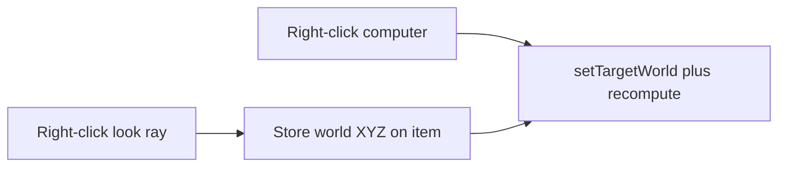

<!-- bc3188cc-a29f-42e2-b007-609a2304a6e3 -->
---
todos:
  - id: "look-helper"
    content: "Extract 200-block look + Sable world projection helper from setTargetFromLook"
    status: pending
  - id: "radar-item"
    content: "Add MissileRadarItem: look-store, computer-apply, shift-clear; register + lang + icon"
    status: pending
isProject: false
---
# Missile Radar look-and-apply tool

The [Ship Target Tool](src/main/java/net/bullettrain/xenopixelsmod/item/custom/TargetToolItem.java) already **applies** stored XYZ on a computer, but air-click opens a GUI and a world-block click does **not** save the look point. You asked for a **new** item, so the Target Tool stays as linker + XYZ GUI.

The computer already has look-ray math in [`ShipVlsGuidanceBlockEntity.setTargetFromLook`](src/main/java/net/bullettrain/xenopixelsmod/block/entity/ShipVlsGuidanceBlockEntity.java) (`player.pick(200)`, Sable `projectOutOfSubLevel`). Reuse that for the radar.

## Behavior

New item `missile_radar`, stacks to 1.

- **Right-click** (air or any block that is not a guidance computer): `player.pick(200, 0, false)`. Store the hit as world `BlockPos` (project out of a Sable sub-level when the hit is on a ship). Chat + tooltip show `X Y Z`. Miss = no change + a miss message.
- **Right-click a ballistic guidance computer** (stock or fork): if coords are stored, `setTargetWorld` + `recomputeSolution` + `broadcastFleetTarget`, same as the Target Tool apply path. Consume the click so the GUI does not open. If empty, tell the player to look-click a point first.
- **Shift-right-click air:** clear stored coords.

Do not add linker modes, a GUI, or a fork clone.

## Files

- New [`MissileRadarItem.java`](src/main/java/net/bullettrain/xenopixelsmod/item/custom/MissileRadarItem.java): `use` / `useOn`, NBT via `DataComponents.CUSTOM_DATA` (same pattern as `TargetToolItem.setStoredTarget`).
- Pull the 200-block look + Sable projection out of `setTargetFromLook` into a small shared helper (e.g. `MissileLookTarget.fromPlayer(Player)`) so the computer and the radar cannot drift.
- Register in [`ModsItems.java`](src/main/java/net/bullettrain/xenopixelsmod/item/ModsItems.java) and the creative tab next to the Target Tool.
- Lang, item model JSON, 32x32 icon (distinct from the target tool — dish/radar, colorful).
- No crafting recipe (Target Tool has none either).

## Test

A focused test on the helper: miss / block hit → `BlockPos.containing`; empty vs stored NBT round-trip if it stays Minecraft-free. Do not claim in-game look-apply is verified without a live client.
