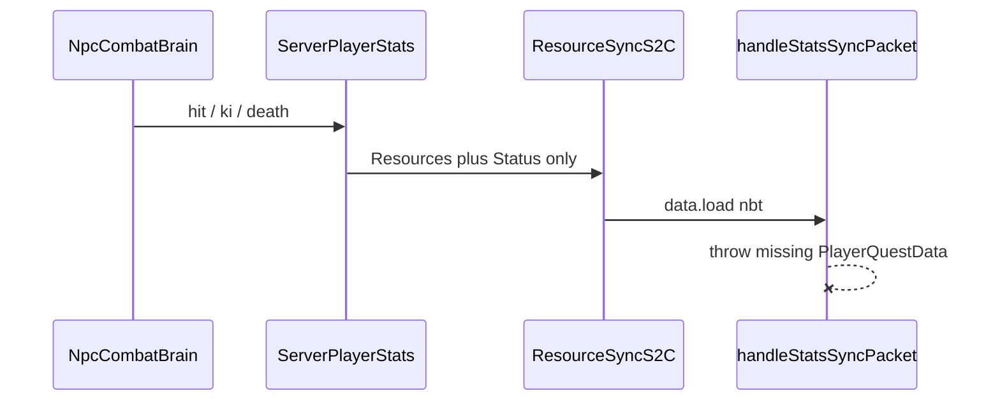

<!-- bc3188cc-a29f-42e2-b007-609a2304a6e3 -->
---
todos:
  - id: "npc-hp-math"
    content: "Lift NpcVitalityMath clamp; float-parity HP; living double + CNPC int saturate; update tests and GUI/persist"
    status: pending
  - id: "resource-sync-mixin"
    content: "Client mixin: partial ResourceSync NBT merges without StatsData.load throw; unit-test the NBT helper"
    status: pending
isProject: false
---
# NPC HP parity and ResourceSync crash

Two separate bugs. Combat brain is the trigger for the log, not the broken class.

## 1. NPC HP stuck at 1,048,576

Players at VIT `2147483647` reach ~`3865470464` HP because DMZ `StatsData.getHealthBonus()` is a **float** (`vit * VIT_scaling * form VIT`), added as an `ADD_VALUE` modifier, and [VanillaCombatAttributeCapMixin.java](src/main/java/net/bullettrain/xenopixelsmod/mixin/common/VanillaCombatAttributeCapMixin.java) already set `generic.max_health` to `Double.MAX_VALUE`.

NPCs use the same formula in [NpcVitalityMath.java](src/main/java/net/bullettrain/xenopixelsmod/compat/npc/NpcVitalityMath.java) then **intentionally clamp** to DMZ’s old engine ceiling:

```5:38:src/main/java/net/bullettrain/xenopixelsmod/compat/npc/NpcVitalityMath.java
    static final int MAX_HEALTH = 1_048_576;
    // ...
    private static int clampMaxHealth(double calculated) {
        if (!Double.isFinite(calculated) || calculated >= MAX_HEALTH) {
            return MAX_HEALTH;
        }
        return Math.max(1, (int) Math.round(calculated));
    }
```

That is why VIT max still shows `1048576`.

**Change**

- Compute HP as `20 + (float)(vit * formVit * vitScaling)` (same float rounding as `getHealthBonus()`), clamp at `Float.MAX_VALUE`.
- [NpcVitalitySync.java](src/main/java/net/bullettrain/xenopixelsmod/compat/npc/NpcVitalitySync.java): `pushLivingMaxHealth` takes `double` and `setBaseValue` on the living attribute (combat source of truth). Call this **after** CustomNPC/MyNPCs `setMaxHealth(int)`.
- CNPC/MyNPCs `setMaxHealth(int)` saturates at `Integer.MAX_VALUE` (2,147,483,647). That native field cannot store 3.86B; living HP still can.
- Persist last applied HP as **double** (new tag). Keep the old int tag for migration.
- GUI: Xeno DMZ / locked Stats “Health (DMZ)” should print the true living value (string of the rounded double), not the 1M int. Native CNPC save still gets the saturated int.

Update [NpcVitalityMathTest.java](src/test/java/net/bullettrain/xenopixelsmod/compat/npc/NpcVitalityMathTest.java): VIT `Integer.MAX_VALUE` with scale `1.8` must be `20 + (float)(2147483647 * 1.8)` (~player 3.86B), not `1_048_576`. Overflow case becomes `Float.MAX_VALUE`, not 1M.

Do not mix this into missile files.

## 2. log.txt “crash” when an NPC brain hits you

Verified in [log.txt](log.txt): after kill / otherworld / resource sync, **not** an `NpcCombatBrain` stack.

```
ResourceSyncS2C.handle
  → ClientPacketHandler.handleStatsSyncPacket
    → StatsData.load(nbt)
      → ClassNotFoundException: PlayerQuestData not found in NBT
```

[ResourceSyncS2C.java](tools/generated/dmz_decompiled_full/com/dragonminez/common/network/S2C/ResourceSyncS2C.java) only writes `Resources` + `Status`. [StatsData.load](tools/generated/dmz_decompiled_full/com/dragonminez/common/stats/StatsData.java) **requires** `PlayerQuestData` and throws. Full [StatsSyncS2C](tools/generated/dmz_decompiled_full/com/dragonminez/common/network/S2C/StatsSyncS2C.java) is fine. [ProgressionSyncS2C](tools/generated/dmz_decompiled_full/com/dragonminez/common/network/ClientPacketHandler.java) already merges partially and skips missing quests.

NPC combat, ki spend, death, and `DmzSync.syncResources` all send the partial packet. [DmzSync.java](src/main/java/net/bullettrain/xenopixelsmod/api/dmz/DmzSync.java) already documents this DMZ 2.1.3 footgun.



**Change** (narrow client mixin, DMZ additive)

- New helper e.g. `DmzPartialStatsNbt` (pure): `isFullBlob(nbt)` = contains `PlayerQuestData`; else apply Resources/Status (same keys ResourceSync writes).
- Mixin `ClientPacketHandler.handleStatsSyncPacket` `@At("HEAD")` `cancellable=true`: if not a full blob, merge those compounds and cancel (do not call `load`). Full `StatsSyncS2C` still uses vanilla `load`.
- Register in the **client** list of [xenopixelsmod.mixins.json](src/main/resources/xenopixelsmod.mixins.json). Target is always-present DMZ 2.1.3; verify method with `javap` on `libs/dragonminez-2.1.3.jar`.
- Unit-test the helper with a Resources/Status-only tag vs a tag that includes `PlayerQuestData`.

Do **not** swallow `StatsData.load` on disk/capability restore (missing quests there is a real save problem).

## Validation

- `./gradlew test --tests net.bullettrain.xenopixelsmod.compat.npc.NpcVitalityMathTest --tests <partial-nbt-test>`
- `./gradlew compileJava`
- Manual (not claimed verified): new singleplayer world, NPC VIT `2147483647`, confirm living HP ≈ player; NPC brain attack must not spam `PlayerQuestData` in the client log.
