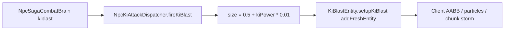
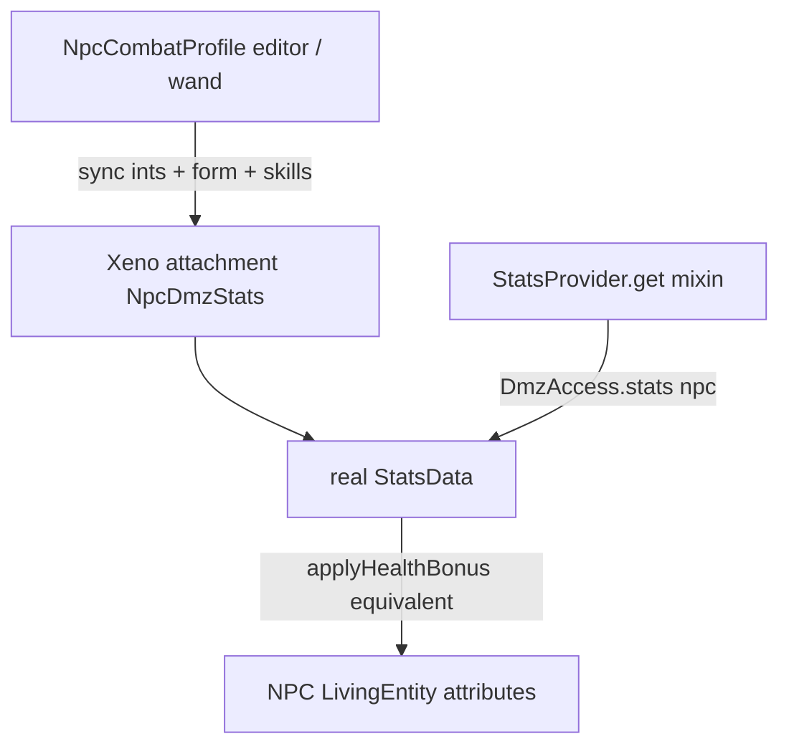

<!-- bc3188cc-a29f-42e2-b007-609a2304a6e3 -->
---
todos:
  - id: "ki-size-clamp"
    content: "Replace linear kiblast/kiwave size/speed with DMZ technique defaults + config clamp; unit-test Integer.MAX_VALUE kiPower"
    status: pending
  - id: "npc-stats-attachment"
    content: "Add NPC StatsData attachment; mixin StatsProvider.get; bind attributes to the living NPC (no world FakePlayer)"
    status: pending
  - id: "sync-profile-into-stats"
    content: "On profile apply/load, copy editor ints/forms/skills into StatsData; HP via DMZ health modifier; persist StatsData NBT"
    status: pending
  - id: "dispatcher-read-stats"
    content: "Ki damage from StatsData.getKiDamage() when attached; keep Phase 1 size/speed"
    status: pending
  - id: "validate-live-kiblast"
    content: "Focused tests then live runClient: max-stat brain v3 kiblast must not crush; record leftover forge: attribute warnings"
    status: pending
isProject: false
---
# NPC real StatsData + kiblast crush

## What the 16:53 log actually shows

The crush is **not** the `forge:step_height_addition` / `forge:entity_gravity` lines. Those are AttributeMap leftovers (old Forge IDs) logged on the **worldgen** thread when a huge collision box forces mass chunk/entity load.

The crash path is combat brain v3 → [`NpcSagaCombatBrain.fireKi`](src/main/java/net/bullettrain/xenopixelsmod/compat/npc/brain/v2/NpcSagaCombatBrain.java) (`"kiblast"`) → [`NpcKiAttackDispatcher.fireKiBlast`](src/main/java/net/bullettrain/xenopixelsmod/compat/npc/NpcKiAttackDispatcher.java):

```59:65:src/main/java/net/bullettrain/xenopixelsmod/compat/npc/NpcKiAttackDispatcher.java
        float damage = profile.kiDamage() * charge;
        float speed = (1.2f + profile.kiPower * 0.02f) * Math.min(2.0f, charge);
        float size = (0.5f + profile.kiPower * 0.01f) * charge;
        ...
        blast.setupKiBlast(caster, damage, speed, color, size, DEFAULT_CAST_TIME);
```

Players never do this. [`TechniqueDispatcher`](tools/generated/dmz_decompiled_full/com/dragonminez/common/stats/techniques/TechniqueDispatcher.java) uses `KiAttackData.getSize()` / `getSpeed()` (defaults: SMALL_BALL size **3**, speed **1**). A cloned max `kiPower` of `2_147_483_647` makes NPC size ~21 million blocks and speed ~43 million blocks/tick. `setupKiBlast` then `addFreshEntity`s that projectile with no further clamp.

Named techniques in `firePredefinedTechnique` already use `data.getSize() * charge` and are safe. Only generic `kiblast` / `kiwave` (and clash-wave copies of that wave formula) are lethal.

The earlier `sparking.meter` and `xeno_body_punch_right_v4` lines are unrelated success logs.



## Phase 1 — stop the crush (do this first)

Change generic projectile **geometry** to match DMZ player kiblasts. Keep **damage** on `profile.kiDamage()` (that formula is already `kiPower * scaling * release`, same idea as `StatsData.getKiDamage()`).

- In [`NpcKiAttackDispatcher`](src/main/java/net/bullettrain/xenopixelsmod/compat/npc/NpcKiAttackDispatcher.java), replace linear size/speed with:
  - size = `KiAttackData.getDefaultSizeForType(type) * charge` (SMALL_BALL for kiblast, WAVE default 1.0 for kiwave)
  - speed = `KiAttackData.getDefaultSpeedForType(type) * min(2, charge)`
  - then `Mth.clamp` to [`XenoServerConfig.kiProjectileMaxSize` / `kiProjectileMaxSpeed`](src/main/java/net/bullettrain/xenopixelsmod/config/XenoServerConfig.java) (320 / 32) so a future formula cannot spawn a planet-sized ball
- Apply the same helper to `fireKiBlast`, `fireKiWave`, and `fireClashWave`. Leave `fireMirroredWave` / named techniques on `KiAttackData.getActualSize/Speed`.
- Unit test: `kiPower = Integer.MAX_VALUE` → size ≤ 320, speed ≤ 32, and default unclamped kiblast size is 3 × charge.

Do **not** treat the AttributeMap warnings as a FakePlayer bug until a **quiet** (no kiblast) FULL-NPC spawn still prints them. If they persist, the client [`NpcFullDmzRenderer.ProxyPlayer`](src/main/java/net/bullettrain/xenopixelsmod/client/compat/npc/NpcFullDmzRenderer.java) constructor is the next place to look — it is `AbstractClientPlayer`, which is the usual source of those two unknown `forge:*` names. That is a follow-up, not the crush fix.

## Phase 2 — real `StatsData` on the NPC (no world FakePlayer)

Verified DMZ 2.1.3 facts:

- [`StatsData(Player)`](tools/generated/dmz_decompiled_full/com/dragonminez/common/stats/StatsData.java) and [`StatsCapability.PLAYER_STATS`](tools/generated/dmz_decompiled_full/com/dragonminez/common/stats/StatsCapability.java) factory `(Player)holder` — an NPC in that attachment **CCEs**.
- [`StatsProvider.get`](tools/generated/dmz_decompiled_full/com/dragonminez/common/stats/StatsProvider.java) returns empty unless `entity instanceof Player`.
- Player HP ~3.86B is `20 + StatsData.getHealthBonus()` via [`StatsEvents.applyHealthBonus`](tools/generated/dmz_decompiled_full/com/dragonminez/server/events/players/StatsEvents.java) (`ADD_VALUE` modifier). CustomNPC `setMaxHealth(int)` still cannot store that; living `float` HP can.

**Do not** spawn a `FakePlayer` / add `EntityType.PLAYER` to the world per NPC. That is the AttributeMap/`worldgen` warning path and will fight CustomNPC identity.

Architecture:



1. **New NeoForge attachment** next to [`XenoCapabilities`](src/main/java/net/bullettrain/xenopixelsmod/capability/XenoCapabilities.java), e.g. `NPC_DMZ_STATS`, serializable with `StatsData.save()` / `load()`. Predicate: [`NpcCounterpartSync.isCustomNpc`](src/main/java/net/bullettrain/xenopixelsmod/compat/npc/NpcCounterpartSync.java) only. Persist independently of CNPC int health.

2. **Host without a world Player.** Mixin `StatsData` / `Stats.setPlayer` so attribute read/write (`MainAttributes.STRENGTH` … `KI_POWER`, `generic.max_health`) go to the **NPC `LivingEntity`**, not a FakePlayer. Register those DMZ attributes onto CustomNPC/MyNPC entity types with `EntityAttributeModificationEvent` (they are not on mobs today). Construct `StatsProvider` through a mixin-widened factory that does not cast the holder to `Player`.

3. **Mixin `StatsProvider.get`** (common, in [`xenopixelsmod.mixins.json`](src/main/resources/xenopixelsmod.mixins.json)): if the entity is a CustomNPC with the attachment, return that `StatsData`. Then `DmzAccess.stats(npc)`, ki owner lookups, and form helpers that already call `StatsProvider.get` start working.

4. **Keep `NpcCombatProfile` as the editor schema** (GUI, scripts, wand). On apply/load, copy STR/SKP/RES/VIT/PWR/ENE, form, skills, techniques, race, release into the real `StatsData`. Combat, HP, and resources **read StatsData** after that, not a second parallel formula — except CNPC native melee, which stays forced to 1 in authoritative mode.

5. **HP:** stop treating CNPC int health as source of truth (already started in [`NpcVitalitySync`](src/main/java/net/bullettrain/xenopixelsmod/compat/npc/NpcVitalitySync.java)). Call the same modifier UUID `StatsEvents` uses (`DMZ Health Bonus`) on the NPC living attribute from `data.getHealthBonus()`. Persist via StatsData NBT; keep the double tag only as a migration fallback.

6. **Client:** FULL render already builds a `ProxyPlayer` and fills its StatsData from the profile. After this, copy the **synced NPC StatsData NBT** onto that proxy (still client-only, still not a world entity). Do not send `PlayerQuestData` in the NPC sync blob (the existing [`DmzResourceSyncPartialLoadMixin`](src/main/java/net/bullettrain/xenopixelsmod/mixin/client/DmzResourceSyncPartialLoadMixin.java) lesson).

7. **Ki after StatsData exists:** `NpcKiAttackDispatcher` damage can switch to `StatsProvider.get(npc).getKiDamage()` when present; size/speed stay on technique defaults from Phase 1.

### First-pass non-goals (player-only DMZ)

Leave these on `ServerPlayer` until a later pass: quests, login/clone/dimension `StatsSyncS2C`, `TickHandler` player tick, sparking HUD for the local player, gravity/HTC. NPCs get stats, resources, forms, skills, techniques, living attributes, and combat. They do not become a second logged-in player.

## Validation

- Unit: max `kiPower` kiblast size/speed clamps; `StatsData` round-trip NBT for VIT max → `getHealthBonus()` float ~3.86B; `StatsProvider.get(npc)` present after apply.
- `./gradlew test` for the focused classes, then full `test`.
- Live (required before calling crush fixed): rebuild, `runClient`, authoritative NPC with max VIT/PWR, brain v3 on, kiblast at a player. Must **not** freeze; projectile size must look like a player SMALL_BALL. Note whether `forge:*` AttributeMap warnings remain on a spawn with **no** ki fire.
- Do not mix missile work. Do not `git add -A`; this tree is already dirty with unrelated user changes.

## Key files

- Crush: [`NpcKiAttackDispatcher.java`](src/main/java/net/bullettrain/xenopixelsmod/compat/npc/NpcKiAttackDispatcher.java), new math test next to [`NpcVitalityMathTest`](src/test/java/net/bullettrain/xenopixelsmod/compat/npc/NpcVitalityMathTest.java)
- Stats host: new attachment + mixins on `StatsProvider.get` / `StatsData` / `Stats.setPlayer`; [`NpcVitalitySync`](src/main/java/net/bullettrain/xenopixelsmod/compat/npc/NpcVitalitySync.java), [`NpcResources`](src/main/java/net/bullettrain/xenopixelsmod/compat/npc/NpcResources.java), [`NpcCombatProfile`](src/main/java/net/bullettrain/xenopixelsmod/compat/npc/NpcCombatProfile.java) apply path
- Mixin lists: [`xenopixelsmod.mixins.json`](src/main/resources/xenopixelsmod.mixins.json)
